# NeuralOps Platform — Architecture Reference

**Audience:** Architecture, platform engineering, security, and SRE teams  
**Scope:** Full stack — backend microservices, API gateway, observability UI APIs, data plane, agents, deployment  
**Status:** Living document aligned with repository layout as of 2026-06

---

## Table of contents

1. [Executive summary](#1-executive-summary)
2. [System context (C4 Level 1)](#2-system-context-c4-level-1)
3. [Container architecture (C4 Level 2)](#3-container-architecture-c4-level-2)
4. [Deployment architecture](#4-deployment-architecture)
5. [Backend structure](#5-backend-structure)
6. [API Gateway — component view](#6-api-gateway--component-view)
7. [Observability UI API layer](#7-observability-ui-api-layer)
8. [Frontend architecture](#8-frontend-architecture)
9. [Data architecture & ER model](#9-data-architecture--er-model)
10. [Section-wise flows](#10-section-wise-flows)
11. [Security architecture](#11-security-architecture)
12. [Platform observability](#12-platform-observability)
13. [API surface map](#13-api-surface-map)
14. [Related documents](#14-related-documents)

---

## 1. Executive summary

**NeuralOps** is an AI-powered observability platform for log analysis, distributed tracing, incident management, alerting, FinOps, and unified operations dashboards. The system is delivered as a **monorepo** with:

| Layer | Technology | Role |
|-------|------------|------|
| **UI** | React 18, TypeScript, Vite, TanStack Router/Query | Operator console; code-split routes; talks to gateway only |
| **Edge** | Go **API Gateway** (`:8080`) | Auth, RBAC, tenant context, rate limits, reverse proxy, **observability UI APIs**, WebSockets |
| **Services** | Go microservices (`:8081–8086`) | Ingestion, analysis, correlation, incident, search, alerting |
| **Data** | PostgreSQL, ClickHouse, Elasticsearch, Kafka, Redis, Qdrant | OLTP, analytics, logs/search, events, cache, vectors |
| **Agents** | `nexagent`, `collector-operator`, `materializer` | Host telemetry, K8s collector CRD, streaming aggregation |
| **IaC / Ops** | Docker Compose, K8s manifests, Terraform | Local demo, hyperscale paths |

**Design principles:** API-first, tenant isolation, secure-by-default gateway middleware, event-driven ingest pipeline, and a **fat gateway surface** for UI features (`internal/observability`) alongside **thin domain microservices** for core pipelines.

---

## 2. System context (C4 Level 1)

Shows who uses the system and what external systems connect.

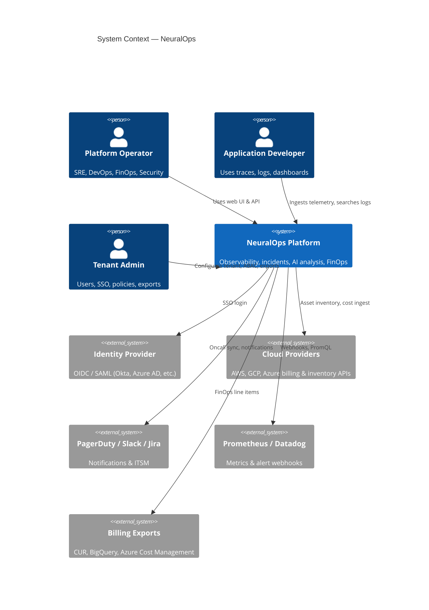

---

## 3. Container architecture (C4 Level 2)

Runtime containers and primary data flows.

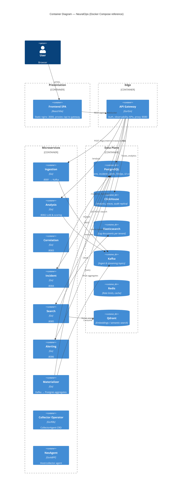

### Request routing rule (important)

The gateway mounts **two classes** of `/api/v1` routes:

| Class | Handler | Examples |
|-------|---------|----------|
| **Native / Observability** | `internal/observability` on gateway | `/dashboards`, `/slos`, `/finops/*`, `/collectors/*`, `/query/unified` |
| **Proxied** | Reverse proxy to microservices | `POST /logs`, `/search/*`, `/incidents/*`, `/analysis/*`, legacy `/alerts` |

Wildcards are avoided where they would collide (e.g. `/logs/metric-rules` vs ingestion `POST /logs`).

---

## 4. Deployment architecture

### 4.1 Local / demo (Docker Compose)

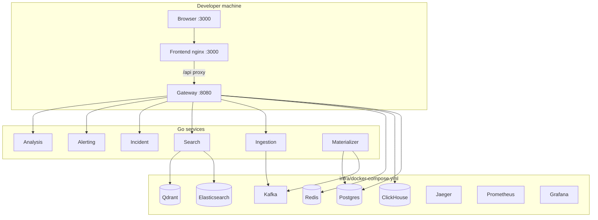

### 4.2 Kubernetes (production-oriented)

| Artifact | Path | Purpose |
|----------|------|---------|
| Collector Operator | `deploy/kubernetes/operator/` | CRD `CollectorAgent`, RBAC, deployment |
| Materializer | `deploy/kubernetes/materializer/` | Streaming aggregation workers |
| Fleet profiling | `deploy/kubernetes/fleet-profiling.yaml` | Profiling ConfigMap pattern |

See [`HYPERSCALE.md`](HYPERSCALE.md) for operator, cloud SDK inventory, and materializer operations.

### 4.3 Build & delivery

| Component | Build | Runtime image |
|-----------|-------|---------------|
| Gateway + observability | `backend/Dockerfile` (multi-stage) | Single binary per service target |
| Frontend | `frontend/Dockerfile` | nginx serves `dist/` |
| Microservices | Same Dockerfile, `CMD` per service | `gateway`, `ingestion`, … |

---

## 5. Backend structure

```
backend/
├── cmd/                    # Service entrypoints
│   ├── gateway/            # API gateway (main UI + API entry)
│   ├── ingestion/          # Telemetry intake
│   ├── analysis/           # AI / classification
│   ├── correlation/        # Trace & dependency correlation
│   ├── incident/           # Incident lifecycle API
│   ├── search/             # Log & semantic search
│   ├── alerting/           # Alert rules & notifications
│   ├── materializer/       # Kafka → Postgres streaming
│   ├── collector-operator/ # K8s operator
│   ├── collector/          # Synthetic / health collector runner
│   ├── nexagent/           # Host agent (eBPF scaffold)
│   └── neuralops/          # CLI (admin, export, health)
├── internal/
│   ├── gateway/            # Auth, proxy, middleware, dashboard, chat, WS
│   ├── observability/      # UI-facing REST (APM, FinOps, SRS, NFR, …)
│   ├── finops/             # Cost domain service (used by observability HTTP)
│   ├── streaming/          # Kafka publisher, materializer logic
│   ├── ai/                 # LLM client
│   ├── tracequery/         # ClickHouse span store
│   ├── cloudinventory/     # AWS/GCP/Azure SDK collectors
│   ├── operator/           # controller-runtime reconciler
│   └── platform/           # DB, health, tenant helpers
├── pkg/nexagent/           # Agent pipeline, eBPF, buffer
├── migrations/             # Goose SQL (Postgres)
└── tests/                  # Contract & integration tests
```

### Microservice responsibilities

| Service | Port | Primary responsibility |
|---------|------|------------------------|
| **Gateway** | 8080 | Security edge, UI API surface, proxy composition |
| **Ingestion** | 8081 | Validate & publish logs/metrics/traces/events to Kafka |
| **Analysis** | 8082 | LLM classification, embeddings, anomaly hints |
| **Correlation** | 8083 | Service graph, deployment & temporal correlation |
| **Incident** | 8084 | Incidents, RCA artifacts, recommendations |
| **Search** | 8085 | Elasticsearch + Qdrant + ClickHouse queries |
| **Alerting** | 8086 | Alert ingestion, dedup, escalation, notify |

---

## 6. API Gateway — component view

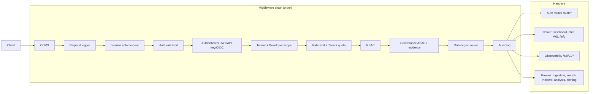

| Package | Responsibility |
|---------|----------------|
| `internal/gateway/auth` | JWT, API keys, OIDC PKCE, SAML, sessions, identity store |
| `internal/gateway/middleware` | RBAC, governance, quotas, audit, license |
| `internal/gateway/proxy` | mTLS-capable reverse proxy to upstream services |
| `internal/gateway/dashboard` | Aggregated dashboard payload for home screen |
| `internal/gateway/chat` | AI chat streaming to LLM |
| `internal/gateway/websocket` | Real-time hub + log tail |
| `internal/observability` | Large REST surface for UI features (see §7) |

---

## 7. Observability UI API layer

The UI does **not** call microservices directly. Almost all product screens use **`/api/v1`** on the gateway, implemented in `internal/observability`.

### 7.1 Route registration (logical domains)

```mermaid
flowchart TB
  RR[RegisterRoutes]
  RR --> CORE[registerCoreRoutes]
  RR --> DOM[registerDomainRoutes]

  CORE --> APM["/apm traces, flow"]
  CORE --> Q["/query unified, NexQL"]
  CORE --> COL["/collectors fleet, pipelines"]
  CORE --> MET["/metrics /dashboards"]
  CORE --> LOG["/logs rules, tiering"]
  CORE --> SEC["/security /integrations"]
  CORE --> ADM["/admin users, keys"]

  DOM --> CN[registerCloudNetworkRoutes]
  DOM --> EXP[registerExperienceRoutes]
  DOM --> GOV[registerGovernanceRoutes]
  DOM --> NFR[registerNFRRoutes]
  DOM --> FIN[registerFinOpsRoutes]
  DOM --> SRS[registerSRSRoutes]
  DOM --> EXT[RegisterExtendedRoutes]
  DOM --> DEP[RegisterDepthRoutes]
  DOM --> X[registerExtensionRoutes]
```

| Registrar | Domain | Examples |
|-----------|--------|----------|
| `registerCoreRoutes` | Core product | Traces, dashboards, SLOs, infra, security, marketplace |
| `registerCloudNetworkRoutes` | Cloud & NPM | `/cloud/assets`, `/network/flows`, FinOps summary |
| `registerFinOpsRoutes` | FinOps detail | Costs, budgets, chargeback, scenarios |
| `registerExperienceRoutes` | RUM & synthetic | Funnels, browser/mobile tests, KPI packs |
| `registerGovernanceRoutes` | Enterprise admin | ABAC, residency, MSP, exports |
| `registerNFRRoutes` | Certification | Benchmarks, reliability, a11y |
| `registerSRSRoutes` | SRS parity | Collector upgrade, alert scores, derived metrics |
| `RegisterExtendedRoutes` | Integrations | Cloud metrics query, SSO, on-call, OAuth |
| `registerExtensionRoutes` | Roadmap / depth | eBPF flows, DBM, billing sources, CI webhooks |

### 7.2 Observability component diagram

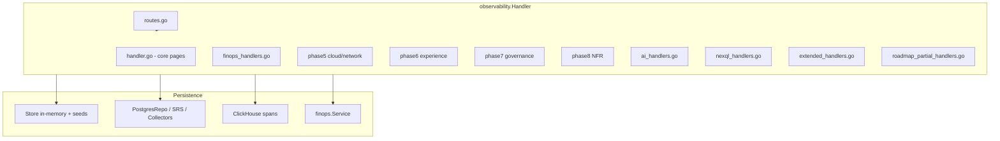

**Persistence strategy:** Demo-ready in-memory `Store` seeds power most screens without Postgres; when `POSTGRES_DSN` is set, repositories overlay tenants, SRS, collectors, FinOps line items, and governance policies.

---

## 8. Frontend architecture

### 8.1 Stack

| Concern | Choice |
|---------|--------|
| UI framework | React 18 + TypeScript |
| Build | Vite 5 |
| Routing | TanStack Router (code-split `lazyPage`) |
| Server state | TanStack Query |
| Client state | Zustand (auth, theme) |
| Styling | Tailwind CSS 4 |
| Charts / graph | Recharts, XYFlow |
| Session replay | rrweb |

### 8.2 Frontend container (C4)

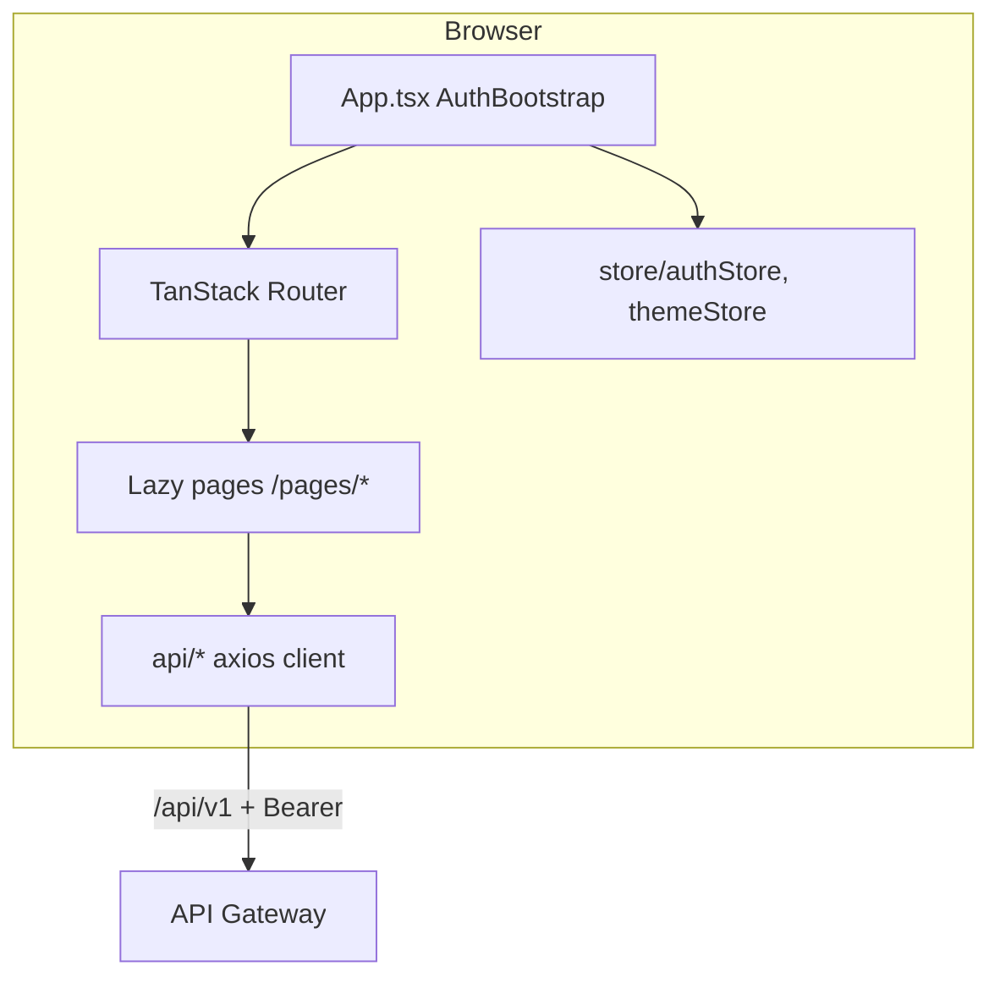

### 8.3 Directory layout

```
frontend/src/
├── api/           # Typed clients (incidents, logs, finops, …)
├── pages/         # Route screens (50+ lazy-loaded)
├── components/    # UI, layout, domain widgets
├── routes/        # lazyPage + chunk recovery
├── store/         # Zustand stores
├── hooks/         # Shared React hooks
├── i18n/          # Messages (en/es/de)
└── router.tsx     # Route tree & auth guards
```

### 8.4 Auth flow (UI)

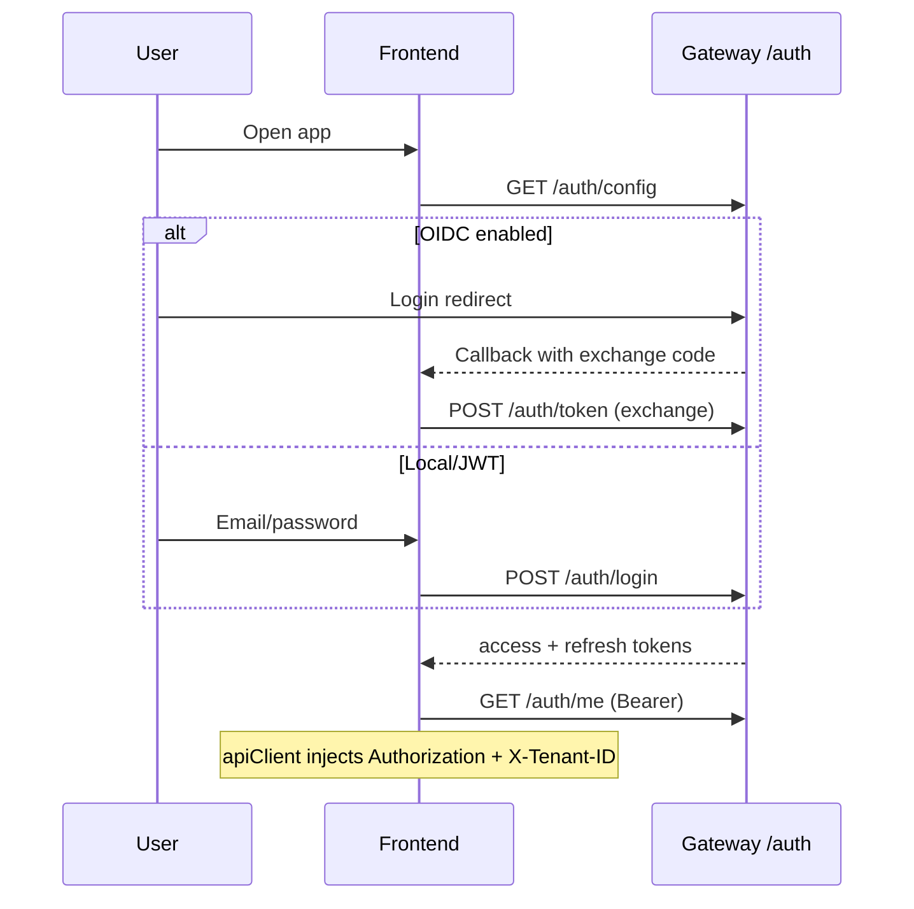

### 8.5 Production serving

| Mode | Port | Notes |
|------|------|-------|
| Dev (`npm run dev`) | 5173 | Vite proxies `/api` → `:8080` |
| Docker | 3000 | nginx serves `dist/`, proxies `/api/` to `gateway:8080` |

Lazy routes load hashed chunks (e.g. `Incidents-*.js`). After deploy, users may need hard refresh; `lazyPage.tsx` auto-reloads once on chunk load failure.

---

## 9. Data architecture & ER model

### 9.1 Store roles

| Store | Workload | Tenant isolation |
|-------|----------|------------------|
| **PostgreSQL** | System of record: users, incidents, alerts, FinOps, UI entities | `tenant_id` column / FK |
| **ClickHouse** | High-volume logs analytics, traces, audit replica | Partitioning by tenant / time |
| **Elasticsearch** | Full-text log search | Index per tenant pattern |
| **Kafka** | Ingest fan-out, streaming samples | Headers / topic naming |
| **Redis** | Rate limiting, ephemeral metrics | Key prefix by tenant |
| **Qdrant** | Vector embeddings | Collection per tenant |

### 9.2 Core ER diagram (PostgreSQL — simplified)

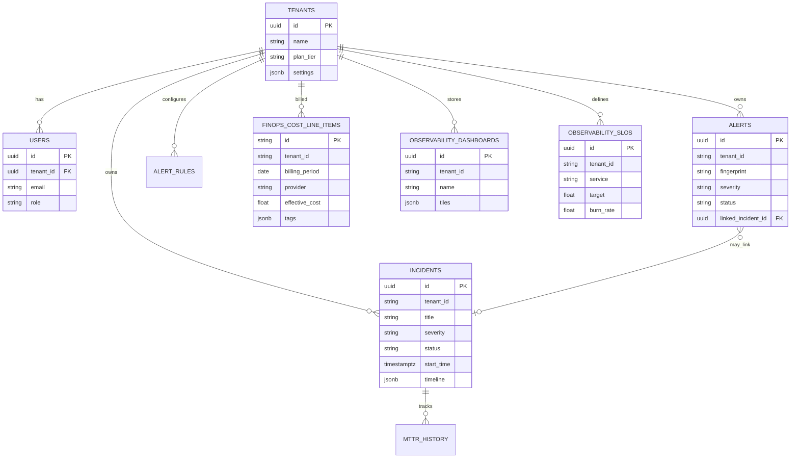

### 9.3 FinOps ER (extension)

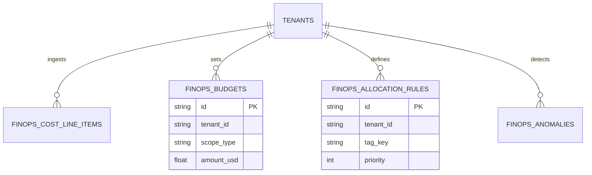

Migrations: `backend/migrations/000023_finops_wave1.up.sql` through `000025_finops_wave3.up.sql`.

### 9.4 Streaming materialization

Topic: `neuralops.observability.stream`  
Consumers: `cmd/materializer` → Postgres tables (`000022_streaming_materialization.up.sql`)  
Producers: Gateway observability (alert policy triggers, derived metrics)

---

## 10. Section-wise flows

### 10.1 Log ingestion

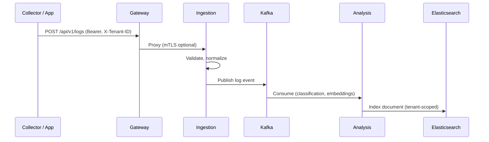

### 10.2 Unified search (UI workbench)

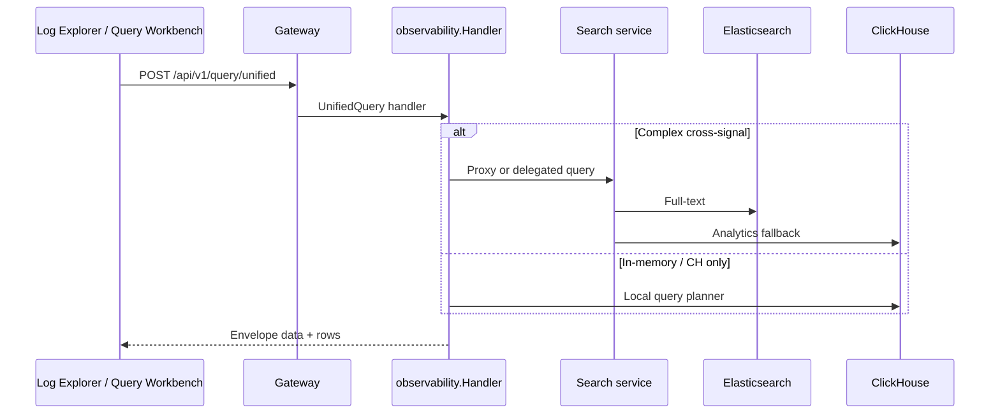

### 10.3 Incident lifecycle

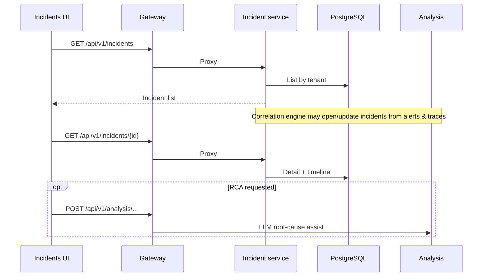

### 10.4 Alerting & notification

```mermaid
sequenceDiagram
  participant Prom as Prometheus/Webhook
  participant GW as Gateway
  participant ING as Ingestion
  participant ALT as Alerting
  participant PG as PostgreSQL
  participant UI as Alerts UI

  Prom->>GW: POST /api/v1/webhooks/prometheus
  GW->>ING: Forward
  ING->>ALT: Internal route / alert event
  ALT->>PG: Dedup by fingerprint, insert alert
  ALT->>ALT: Escalation policy evaluation

  UI->>GW: GET /api/v1/alerts/policies (observability)
  Note over GW: UI policies on gateway; firing alerts may use alerting svc

  UI->>GW: PATCH acknowledge via proxy /api/v1/alerts/{id}/acknowledge
  GW->>ALT: Proxy
```

### 10.5 FinOps cost ingest & dashboard

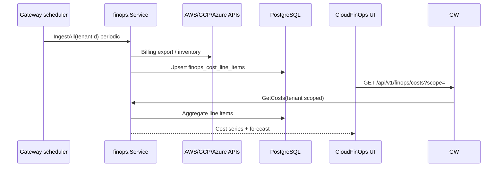

### 10.6 AI chat (operations copilot)

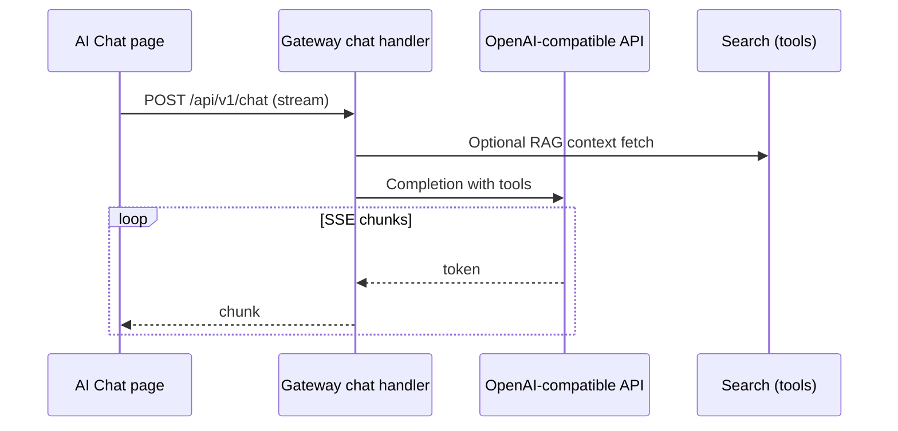

### 10.7 Collector operator (Kubernetes)

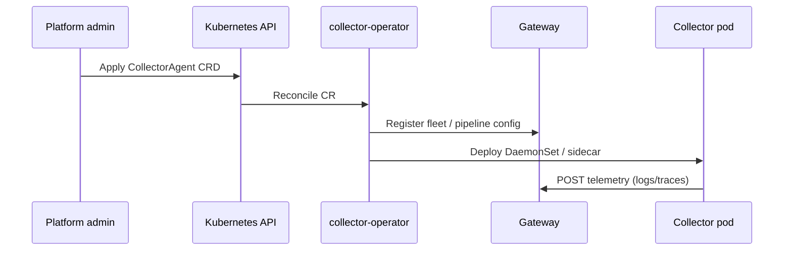

### 10.8 Streaming materialization

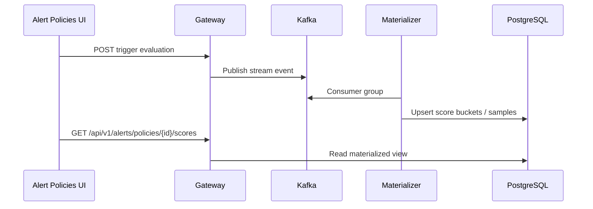

### 10.9 Authentication & governance (request path)

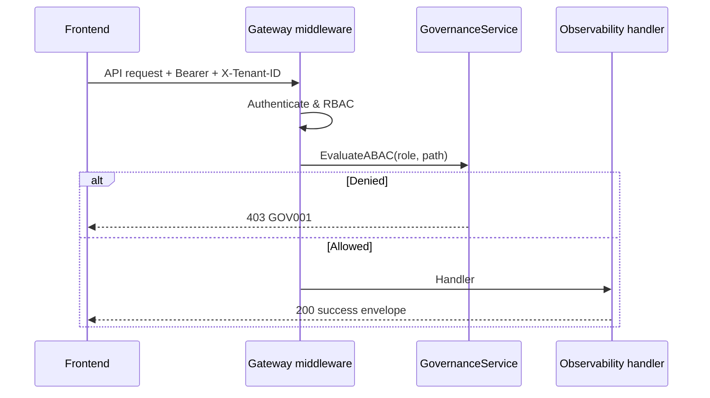

---

## 11. Security architecture

| Control | Implementation |
|---------|----------------|
| **Authentication** | JWT access/refresh, API keys, OIDC PKCE, SAML option |
| **Authorization** | RBAC roles: `ADMIN`, `SRE`, `DEVELOPER`, `READ_ONLY`, `ALERT_MANAGER` |
| **ABAC / residency** | `GovernanceService` + middleware `GOV001`/`GOV002` |
| **Tenant isolation** | `X-Tenant-ID` + context; FinOps & search scoped by tenant |
| **Rate limiting** | Redis-backed global + per-tenant quotas |
| **Audit** | Postgres `audit` tables + optional ClickHouse replication |
| **mTLS** | Optional upstream proxy to microservices |
| **Secrets** | Env / K8s secrets (no keys in repo) |

Evidence and checklist: [`docs/SECURITY_EVIDENCE.md`](SECURITY_EVIDENCE.md).

---

## 12. Platform observability

| Signal | Tool | Endpoint |
|--------|------|----------|
| Metrics | Prometheus | Each service `/metrics` |
| Traces | OpenTelemetry → Jaeger | `OTEL_EXPORTER_OTLP_ENDPOINT` |
| Dashboards | Grafana | Compose stack in `infra/` |
| Logs | Structured JSON (Zap) | `traceId`, `tenantId` fields |

---

## 13. API surface map

| Prefix | Owner | Purpose |
|--------|-------|---------|
| `/health`, `/ready`, `/live` | Gateway | Probes |
| `/auth/*` | Gateway | Login, OIDC, refresh, me |
| `/api/v1/info` | Gateway | Build info |
| `/api/v1/logs` (POST) | Ingestion proxy | Log ingest |
| `/api/v1/search/*` | Search proxy | Search & traces |
| `/api/v1/incidents/*` | Incident proxy | Incidents API |
| `/api/v1/analysis/*` | Analysis proxy | AI analysis |
| `/api/v1/alerts` (subset) | Alerting proxy | Legacy alerting API |
| `/api/v1/*` (majority) | Observability | UI dashboards, FinOps, SRS, NFR, etc. |
| `/swagger/*` | Gateway | OpenAPI UI |

Contract tests: `backend/tests/contract/observability_contract_test.go`  
OpenAPI: `backend/openapi/swagger.yaml`, `docs/openapi/gateway-v1.yaml`

---

## 14. Related documents

| Document | Content |
|----------|---------|
| [`../ARCHITECTURE.md`](../ARCHITECTURE.md) | Short architecture summary |
| [`../README.md`](../README.md) | Quick start & ports |
| [`SRS_NEURALOPS_COMPARISON_GAP.md`](SRS_NEURALOPS_COMPARISON_GAP.md) | SRS traceability |
| [`BANK_PRODUCTION_READINESS_ROADMAP.md`](BANK_PRODUCTION_READINESS_ROADMAP.md) | Production gates |
| [`HYPERSCALE.md`](HYPERSCALE.md) | Operator, materializer, cloud SDK |
| [`FINOPS_ENHANCEMENT_REQUIREMENTS.md`](FINOPS_ENHANCEMENT_REQUIREMENTS.md) | FinOps depth |
| [`SECURITY_EVIDENCE.md`](SECURITY_EVIDENCE.md) | Security controls evidence |
| [`LOCAL_TEST_URLS.md`](LOCAL_TEST_URLS.md) | Dev URLs & smoke tests |

---

## Document maintenance

When adding a new **UI screen**, expect: `frontend/src/pages/*`, `frontend/src/api/*`, and a registrar in `backend/internal/observability/routes.go` (or domain handler file).

When adding a new **microservice endpoint**, expect: service `internal/*/handler`, gateway proxy route in `internal/gateway/app.go`, and contract test update.

**Diagram legend:** Mermaid diagrams render in GitHub, GitLab, VS Code, and most Markdown viewers. For formal C4 exports, import the Mermaid sources into Structurizr or IcePanel if your team standardizes on those tools.
