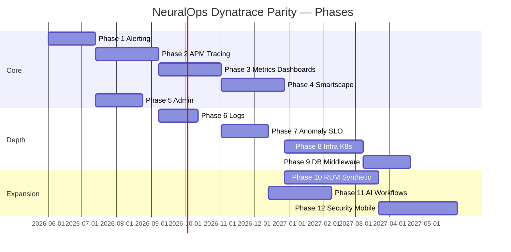

# NeuralOps UI — Dynatrace Parity Implementation Plan

**Version:** 1.0  
**Last updated:** 2026-05-31  
**Audience:** Product, engineering leadership, program management  
**Related docs:** [UI_DYNATRACE_GAP.md](./UI_DYNATRACE_GAP.md), [FRONTEND_STACK.md](./FRONTEND_STACK.md), [PRODUCTION_AND_GTM.md](./PRODUCTION_AND_GTM.md)

---

## Table of contents

1. [Overview](#1-overview)
2. [Assumptions and team model](#2-assumptions-and-team-model)
3. [Architecture prerequisites](#3-architecture-prerequisites)
4. [Phase summary timeline](#4-phase-summary-timeline)
5. [Phase 1 — Alerting & ops self-serve](#5-phase-1--alerting--ops-self-serve)
6. [Phase 2 — APM: PurePath-style tracing](#6-phase-2--apm-purepath-style-tracing)
7. [Phase 3 — Metrics explorer & dashboards](#7-phase-3--metrics-explorer--dashboards)
8. [Phase 4 — Live Smartscape & entity navigation](#8-phase-4--live-smartscape--entity-navigation)
9. [Phase 5 — Enterprise admin & governance UI](#9-phase-5--enterprise-admin--governance-ui)
10. [Phase 6 — Log platform depth & cross-drill](#10-phase-6--log-platform-depth--cross-drill)
11. [Phase 7 — Anomaly intelligence & SLOs](#11-phase-7--anomaly-intelligence--slos)
12. [Phase 8 — Infrastructure & Kubernetes](#12-phase-8--infrastructure--kubernetes)
13. [Phase 9 — Database & middleware monitoring](#13-phase-9--database--middleware-monitoring)
14. [Phase 10 — RUM, synthetic & session replay](#14-phase-10--rum-synthetic--session-replay)
15. [Phase 11 — AI entity model, workflows & notebooks](#15-phase-11--ai-entity-model-workflows--notebooks)
16. [Phase 12 — Security, mobile & ecosystem](#16-phase-12--security-mobile--ecosystem)
17. [Cross-phase engineering standards](#17-cross-phase-engineering-standards)
18. [Risk register](#18-risk-register)
19. [Gap-to-phase traceability matrix](#19-gap-to-phase-traceability-matrix)

---

## 1. Overview

This plan implements **every UI gap** documented in [UI_DYNATRACE_GAP.md](./UI_DYNATRACE_GAP.md). Work is sequenced by **dependency order**, **customer revenue impact**, and **reuse of existing backend services**.

### Current backend assets (reuse, do not rebuild)

| Service | Existing capability relevant to UI |
|---------|-----------------------------------|
| **Gateway** | Auth (OIDC/SAML), RBAC, dashboard aggregate, WebSocket, audit repo |
| **Alerting** | `GET/POST /alerts/rules`, `GET/POST /notifications/channels`, alert list/ack/suppress |
| **Search** | Log search, AI search, trace-by-ID (log hits), transaction search |
| **Incident** | Incidents CRUD, timeline, recommendations, `GET /services/dependency-map` |
| **Ingestion** | Logs, metrics, events, **trace spans** via `POST /traces` |
| **Correlation** | Trace span consumer → dependency graph builder |
| **Analysis** | Anomaly detection, AI explanations |
| **Infra** | Grafana dashboards, Jaeger/OTEL, Prometheus, ClickHouse |

### Strategic principle

Build an **entity-centric observability UI** incrementally. Phases 1–5 deliver **credible enterprise observability** for SRE/incident buyers. Phases 6–12 close **full Dynatrace parity** including RUM, infra, and security.

### Total estimated duration

| Team size | Calendar to Phase 5 (enterprise-ready) | Calendar to Phase 12 (full parity) |
|-----------|------------------------------------------|-------------------------------------|
| 4 engineers (2 FE, 2 BE) | ~7–9 months | ~24–30 months |
| 8 engineers (4 FE, 4 BE) | ~4–5 months | ~14–18 months |
| 12 engineers (5 FE, 5 BE, 2 platform) | ~3–4 months | ~10–12 months |

Estimates include UI, API, tests, and docs — not sales/legal/compliance (SOC 2, etc.).

---

## 2. Assumptions and team model

### Roles per phase

- **FE** — React/TypeScript, TanStack Router/Query, design system
- **BE** — Go microservices, Kafka, ES/ClickHouse, OTEL
- **Platform** — K8s agents, collectors, SDKs (RUM, synthetic)
- **Design** — 0.5 FTE shared for new modules (waterfall, dashboard builder)

### Definition of done (every phase)

- [ ] Feature behind RBAC permission where applicable
- [ ] Playwright E2E for primary happy paths
- [ ] API contract documented in `docs/API.md` (or OpenAPI via gateway swagger)
- [ ] Loading, empty, and error states in UI
- [ ] Structured logging + Prometheus metrics on new endpoints
- [ ] `UI_DYNATRACE_GAP.md` parity row updated when shipped

---

## 3. Architecture prerequisites

Complete **before Phase 2** (can run in parallel with Phase 1):

| Prerequisite | Purpose |
|--------------|---------|
| **Unified entity ID schema** | `entityType`, `entityId`, `tenantId`, `displayName` across traces, metrics, logs |
| **Trace span store** | Persist full span trees (ClickHouse or Jaeger query API), not log-derived pseudo-traces |
| **Metrics query API** | `GET /api/v1/metrics/query` with PromQL or internal DSL |
| **Frontend feature flags** | Gradual rollout per phase (`VITE_FEATURE_*`) |
| **Shared drill-down shell** | Reusable panel: entity header + tabs (Overview, Logs, Traces, Metrics) |

Suggested new packages:

```
backend/internal/entity/     # entity registry + graph
backend/internal/tracequery/ # span tree retrieval
frontend/src/features/       # feature-based modules (traces, alerts, infra, …)
```

---

## 4. Phase summary timeline



| Phase | Name | Duration | Primary gaps closed |
|-------|------|----------|---------------------|
| 1 | Alerting & ops self-serve | 6 weeks | §5.8 Alerting |
| 2 | APM / PurePath tracing | 8 weeks | §5.1 APM |
| 3 | Metrics & dashboards | 8 weeks | §5.9 Dashboards (partial §5.7) |
| 4 | Live Smartscape | 8 weeks | §5.2 Topology |
| 5 | Enterprise admin | 6 weeks | §5.10 Admin |
| 6 | Log platform depth | 5 weeks | §5.4 Logs |
| 7 | Anomaly & SLOs | 6 weeks | §5.3 Davis (partial), §5.9 SLO |
| 8 | Infra & Kubernetes | 10 weeks | §5.5 Infra/K8s/Cloud |
| 9 | DB & middleware | 6 weeks | §5.7 Database |
| 10 | RUM & synthetic | 12 weeks | §5.6 RUM, session replay |
| 11 | AI entity & workflows | 8 weeks | §5.3 Automation, notebooks |
| 12 | Security & ecosystem | 10 weeks | §5.11, §5.12 |

**Note:** Phase 5 can start after Phase 1 (parallel with 2–4). Phases 8–12 are largely independent after Phase 4.

---

## 5. Phase 1 — Alerting & ops self-serve

**Duration:** 6 weeks · **Team:** 2 FE, 1 BE · **Depends on:** none

### Goals

Replace the Alerts stub with full alert lifecycle management using existing alerting service APIs.

### Gaps addressed

- Alert rule builder (thresholds, log/metric events)
- Notification channels (Slack, PagerDuty, email, webhooks)
- Alert silencing / maintenance windows
- Alert history and ack/suppress UI

### Backend work

| Task | Detail |
|------|--------|
| Extend alerting API | `PUT/PATCH/DELETE /alerts/rules/:id`, rule validation, dry-run |
| Channel CRUD | `PUT/DELETE /notifications/channels/:id`, test channel endpoint |
| Maintenance windows | `POST /alerts/silences`, list active silences |
| Alert enrichment | Link alert → incident ID, service, runbook URL |

**Existing APIs to wire:** `ListRules`, `CreateRule`, `ListChannels`, `CreateChannel`, `ListAlerts`, `AcknowledgeAlert`, `SuppressAlert`.

### Frontend work

| Route / component | Deliverable |
|-------------------|-------------|
| `/alerts` | Tabbed: Active alerts, History, Rules, Channels, Silences |
| `AlertRuleForm` | Metric threshold, log pattern, severity, evaluation window |
| `ChannelForm` | Slack webhook, PagerDuty key, email, generic webhook + test |
| `AlertDetailDrawer` | Timeline, linked incident, ack/suppress actions |
| Top bar bell | Navigate to `/alerts?status=firing` with unread sync |

### Exit criteria

- Create/edit/delete rule and channel without API calls
- Firing alert appears in UI within 30s (WebSocket or poll)
- Playwright: create rule → simulate webhook → ack alert

---

## 6. Phase 2 — APM: PurePath-style tracing

**Duration:** 8 weeks · **Team:** 3 FE, 2 BE · **Depends on:** architecture prerequisites

### Goals

Deliver trace waterfall, service flow, and unified trace ↔ log drill-down.

### Gaps addressed

- Waterfall / flame graph viewer
- Service flow (per-hop latency, errors)
- Compare traces
- Request/endpoint grouping UI
- One-click trace → logs → metrics (shared shell)

### Backend work

| Task | Detail |
|------|--------|
| **Trace query service** | `GET /api/v1/traces/:traceId` → span tree JSON |
| **Trace search** | `POST /api/v1/traces/search` — service, operation, duration, status, time range |
| **Span storage** | ClickHouse `spans` table or Jaeger gRPC adapter; migrate from log-only trace search |
| **Service flow API** | `GET /api/v1/traces/flow` — aggregated edges with p50/p95/error rate |
| **Endpoint catalog** | `GET /api/v1/services/:id/operations` — auto-group by operation name |

Enhance ingestion: ensure OTEL/Jaeger spans land in span store (already ingested via `POST /traces`).

### Frontend work

| Route / component | Deliverable |
|-------------------|-------------|
| `/traces` | Search filters + result list (latency, service, status) |
| `/traces/$traceId` | Waterfall (Gantt bars), span detail, tags, logs for span |
| `TraceFlameGraph` | Optional toggle flame view |
| `/traces/compare` | Side-by-side two traces |
| `/service-flow` | Sankey or horizontal flow from service flow API |
| Log Explorer | “Open in trace” action when `traceId` present |
| Incident traces tab | Embed waterfall component |

**Libraries:** Consider `@tanstack/react-virtual` for span list; D3 or custom SVG for waterfall.

### Exit criteria

- Demo trace with 50+ spans renders < 200ms interaction
- Click span → filtered logs for span time range
- Compare slow vs fast trace for same operation

---

## 7. Phase 3 — Metrics explorer & dashboards

**Duration:** 8 weeks · **Team:** 2 FE, 2 BE, 0.5 design · **Depends on:** Phase 2 (shared entity shell)

### Goals

Standalone metrics UI and customizable dashboards (in-app or Grafana-embedded).

### Gaps addressed

- Metric browser / data explorer
- Custom dashboards (drag-drop tiles)
- Scheduled reports (export PDF/PNG)
- Partial middleware metrics (Kafka lag tile)

### Backend work

| Task | Detail |
|------|--------|
| Metrics query API | PromQL proxy or ClickHouse rollup queries |
| Metric metadata | `GET /api/v1/metrics/catalog` — names, labels, units |
| Dashboard CRUD | `GET/POST/PUT/DELETE /api/v1/dashboards` — JSON tile layout |
| Dashboard share | Per-tenant, per-role visibility |
| Export job | Async PNG/PDF generation (optional queue) |

**Alternative (faster MVP):** Grafana embed with SSO + variable sync; migrate to native builder in Phase 3b.

### Frontend work

| Route / component | Deliverable |
|-------------------|-------------|
| `/metrics` | Metric picker, label filters, time series chart, compare series |
| `/dashboards` | List user + shared dashboards |
| `/dashboards/$id` | Grid layout (react-grid-layout), tile types: timeseries, stat, table, logs |
| `/` (enhance) | Pin user dashboards to Command Center |
| Incident metrics tab | Reuse metric chart components |

### Exit criteria

- Save custom dashboard with 4+ tiles
- Query metric by service label from UI
- Export dashboard PNG

---

## 8. Phase 4 — Live Smartscape & entity navigation

**Duration:** 8 weeks · **Team:** 2 FE, 2 BE · **Depends on:** Phases 2–3

### Goals

Service map driven by live telemetry; entity-centric navigation across the product.

### Gaps addressed

- Auto-discovered topology from OTEL/correlation graph
- Real-time health on nodes and edges
- Drill-down to service → traces, logs, metrics
- Vertical topology layers (optional v1: service layer only)
- Management zones (team-scoped views)
- Dependency change over time (deploy diff)

### Backend work

| Task | Detail |
|------|--------|
| Entity registry | Persist services, edges, health scores (extend correlation `graph.Builder`) |
| Live graph API | `GET /api/v1/topology` — nodes, edges, health, error rate, throughput |
| Graph history | `GET /api/v1/topology/snapshot?at=` for before/after deploy |
| Management zones | `GET /api/v1/zones`, filter topology by zone/tag |
| Health propagation | Roll up child entity health to edges (Kafka consumer) |

**Existing:** `GET /api/v1/services/dependency-map` — evolve to live graph with metrics.

### Frontend work

| Route / component | Deliverable |
|-------------------|-------------|
| `/service-map` | Replace static graph with live API; poll/WebSocket health |
| `EntitySidePanel` | Unified drill: metrics sparkline, recent errors, top traces |
| `/entities/$type/$id` | Canonical entity page (service first; host in Phase 8) |
| Zone selector | Top bar or map filter for management zone |
| Deploy diff mode | Compare topology snapshot T-1h vs now |

### Exit criteria

- Map updates within 60s of injected trace/error traffic
- Click node → entity page with logs and traces
- Zone filter hides out-of-scope services

---

## 9. Phase 5 — Enterprise admin & governance UI

**Duration:** 6 weeks · **Team:** 2 FE, 2 BE · **Depends on:** Phase 1 (can parallel 2–4)

### Goals

Self-serve admin for users, tokens, SSO status, retention, and audit.

### Gaps addressed

- User, team, role management UI
- API token lifecycle
- SSO / IdP read-only status (config remains ops/GitOps)
- Management zones config UI
- Data retention policy UI
- Audit log viewer
- License / usage metering (read-only v1)

### Backend work

| Task | Detail |
|------|--------|
| Admin API group | `/api/v1/admin/*` — users, roles, teams, API keys |
| User CRUD | Extend `IdentityStore`; invite, disable, role assign |
| API keys | Create, revoke, scope by service/permission |
| Retention | Per-tenant log/trace/metric retention settings |
| Audit query | `GET /api/v1/admin/audit` — filter by user, action, time (ClickHouse audit) |
| Usage metrics | `GET /api/v1/admin/usage` — ingest volume, AI token count |

### Frontend work

| Route / component | Deliverable |
|-------------------|-------------|
| `/settings` | Hub: Users, Teams, API Keys, SSO, Retention, Audit, Usage |
| `/settings/users` | Table, invite, role dropdown (RBAC from gateway) |
| `/settings/api-keys` | Create key, copy once, revoke |
| `/settings/audit` | Searchable audit log table |
| `/settings/retention` | Sliders/days per data type |

### Exit criteria

- Admin creates user and API key; key works on search API
- Audit log shows login and rule change events
- Non-admin cannot access `/settings/users`

---

## 10. Phase 6 — Log platform depth & cross-drill

**Duration:** 5 weeks · **Team:** 2 FE, 1 BE · **Depends on:** Phase 2

### Goals

Close remaining log monitoring gaps and deep trace integration.

### Gaps addressed

- Log metrics (count-based patterns) in UI
- Log parsing / processing rule editor
- Log retention / bucket policy UI (links to Phase 5 retention)
- Click log line → exact span in waterfall

### Backend work

| Task | Detail |
|------|--------|
| Log metrics rules | `POST /api/v1/logs/metrics-rules` — pattern → metric counter |
| Parsing rules | Grok/regex pipeline config (stored per tenant) |
| Span correlation | Index `spanId` on log documents; join API |

### Frontend work

| Route / component | Deliverable |
|-------------------|-------------|
| `/logs/settings` | Parsing rules, log metrics rules |
| Log detail panel | “View span” → `/traces/$traceId?spanId=` |
| `/alerts` integration | Create alert from saved log metric rule |

### Exit criteria

- Log metric rule feeds alert rule (Phase 1)
- Parse rule applied to new ingested logs (verify in UI sample)

---

## 11. Phase 7 — Anomaly intelligence & SLOs

**Duration:** 6 weeks · **Team:** 2 FE, 2 BE · **Depends on:** Phases 3–4

### Goals

Entity-level anomalies and SLO/error budget management.

### Gaps addressed

- Anomaly baselines per metric/entity
- Causal analysis graph (entity-centric v1)
- SLO / SLI definitions and error budget UI
- SLO-based alerting (extends Phase 1)

### Backend work

| Task | Detail |
|------|--------|
| Anomaly API | `GET /api/v1/anomalies` — filter by entity, severity, time |
| Baseline engine | Per-entity seasonal baseline (analysis service) |
| SLO CRUD | `POST /api/v1/slos` — SLI query, target, window |
| Error budget | Computed burn rate; expose in API |
| Causal graph | `GET /api/v1/incidents/:id/causality` — entity nodes + edges |

### Frontend work

| Route / component | Deliverable |
|-------------------|-------------|
| `/anomalies` | Entity list, baseline band chart, link to entity page |
| `/slos` | SLO list, create wizard, error budget gauge |
| `/slos/$id` | Burn chart, alert policies |
| Incident detail | Causal graph tab (entity view) |

### Exit criteria

- Create SLO for service availability; burn shows on dashboard
- Anomaly card links to entity with metric chart

---

## 12. Phase 8 — Infrastructure & Kubernetes

**Duration:** 10 weeks · **Team:** 2 FE, 3 BE, 1 platform · **Depends on:** Phase 4 entity model

### Goals

Host, container, K8s, and cloud resource monitoring UI.

### Gaps addressed

- Host list and detail (CPU, memory, disk, network)
- Process monitoring
- Container views
- Kubernetes: clusters, nodes, namespaces, workloads, pods, events
- Cloud dashboards (AWS first, then Azure/GCP)
- Network monitoring (basic flow metrics)

### Backend work

| Task | Detail |
|------|--------|
| Infra collector | OTEL host/k8s receivers or Prometheus cadvisor/kube-state-metrics |
| Entity types | `host`, `process`, `container`, `k8s.pod`, `k8s.node`, `cloud.instance` |
| Infra APIs | `GET /api/v1/infra/hosts`, `/k8s/clusters`, `/k8s/pods`, etc. |
| K8s events stream | Kafka → ES index → UI |
| Cloud integration | AWS CUR + CloudWatch agent (v1 single vendor) |

### Frontend work

| Route / component | Deliverable |
|-------------------|-------------|
| `/infrastructure/hosts` | Sortable table, health, CPU/mem sparklines |
| `/infrastructure/hosts/$id` | Metrics, processes, logs, traces |
| `/kubernetes` | Cluster selector, namespaces, workloads, pod list |
| `/kubernetes/pods/$id` | Pod metrics, logs, events |
| `/cloud` | AWS account overview (EC2, RDS, Lambda tiles) |
| Service map | Add infra layer toggle (vertical topology v2) |

### Exit criteria

- Demo K8s cluster shows pod list with live CPU
- Host page correlates logs by `host` label
- At least one cloud dashboard (AWS) with 5 resource types

---

## 13. Phase 9 — Database & middleware monitoring

**Duration:** 6 weeks · **Team:** 2 FE, 2 BE · **Depends on:** Phases 3, 8

### Goals

Technology-specific monitoring for databases and message queues.

### Gaps addressed

- Database statement analysis, wait events, connection pools
- Postgres, Redis, Kafka as first-class entities
- Consumer lag and queue depth UI

### Backend work

| Task | Detail |
|------|--------|
| DB collectors | Postgres `pg_stat_statements`, Redis INFO, Kafka consumer groups |
| DB APIs | `GET /api/v1/databases`, `/databases/:id/statements`, `/databases/:id/waits` |
| Middleware APIs | `GET /api/v1/kafka/lag`, `/redis/memory` |
| Entity linking | Auto-link DB → calling services from trace tags |

### Frontend work

| Route / component | Deliverable |
|-------------------|-------------|
| `/databases` | Instance list, QPS, slow query count |
| `/databases/$id` | Top statements, wait events, connection pool chart |
| `/middleware/kafka` | Topic lag, consumer group table |
| `/middleware/redis` | Memory, hit rate, connected clients |

### Exit criteria

- Slow query table with link to traces containing `db.statement`
- Kafka lag alert integrates with Phase 1 rules

---

## 14. Phase 10 — RUM, synthetic & session replay

**Duration:** 12 weeks · **Team:** 3 FE, 2 BE, 2 platform · **Depends on:** Phase 4

### Goals

Frontend observability and proactive synthetic monitoring.

### Gaps addressed

- Browser RUM (page load, JS errors, Core Web Vitals)
- Mobile RUM (iOS/Android SDKs)
- User session analysis and funnels
- Session replay
- Synthetic HTTP/browser monitors

### Backend work

| Task | Detail |
|------|--------|
| RUM ingestion | `POST /api/v1/rum/events` — page views, errors, vitals |
| RUM SDK | JS snippet + optional React router integration |
| Mobile SDK | iOS/Android minimal agents (separate repo acceptable) |
| Session store | ClickHouse sessions + object storage for replay blobs |
| Synthetic runner | Scheduled workers (K8s CronJob) + result store |
| Synthetic API | CRUD monitors, run history, locations |

### Frontend work

| Route / component | Deliverable |
|-------------------|-------------|
| `/rum` | Geo map, page load histogram, error rate |
| `/rum/sessions` | Session list, device/browser, duration |
| `/rum/sessions/$id` | Waterfall of user actions, replay player |
| `/synthetic` | Monitor list, create HTTP/browser check |
| `/synthetic/$id/runs` | Run history, screenshot, latency by location |
| `/rum/funnels` | Funnel builder (step sequence) |

### Exit criteria

- RUM SDK on demo app sends vitals visible in UI within 1 min
- Synthetic monitor runs every 5 min; failure opens alert
- Session replay plays for recorded demo session

---

## 15. Phase 11 — AI entity model, workflows & notebooks

**Duration:** 8 weeks · **Team:** 2 FE, 2 BE, 1 ML · **Depends on:** Phases 4, 7

### Goals

Extend NeuralOps AI from log-centric to entity-centric; add automation and notebooks.

### Gaps addressed

- Root cause on entities (host, service, DB)
- Automatic problem correlation (enhance incidents)
- Workflow / remediation automation UI
- Notebooks for ad-hoc analysis
- Enhance AI Assistant with entity context

### Backend work

| Task | Detail |
|------|--------|
| Entity RCA | Analysis service consumes entity graph + metrics for causality |
| Problem auto-close | Rules when metrics normalize (incident engine) |
| Workflow engine | `POST /api/v1/workflows` — trigger, steps, approval gates |
| Notebook API | Save/load notebook cells (queries + AI prompts) |
| Copilot context | Pass selected entity IDs to chat API |

### Frontend work

| Route / component | Deliverable |
|-------------------|-------------|
| `/workflows` | List, visual editor (trigger → action) |
| `/notebooks` | Cell-based UI: query, chart, markdown, AI cell |
| Entity pages | “Explain with AI” using entity context |
| Incident detail | Auto problem lifecycle indicators |

### Exit criteria

- Workflow: on P1 incident → Slack + Jira ticket (mock ok)
- Notebook saves and shares query + chart
- AI chat answers “why is payment-service slow?” using entity metrics

---

## 16. Phase 12 — Security, mobile & ecosystem

**Duration:** 10 weeks · **Team:** 2 FE, 2 BE, 2 mobile/platform · **Depends on:** Phases 8–10

### Goals

Application security module, mobile on-call app, and integration marketplace.

### Gaps addressed

- Runtime application security (vulnerabilities, attacks)
- Security dashboards
- Attack analytics
- Native mobile client
- Extension marketplace
- Integration wizards (Jira, ServiceNow, CI/CD)

### Backend work

| Task | Detail |
|------|--------|
| AppSec ingestion | RASP/agent events or log-based attack patterns |
| Security API | `GET /api/v1/security/vulnerabilities`, `/attacks` |
| Mobile BFF | Push notifications for incidents/alerts |
| Integrations | OAuth apps for Jira, ServiceNow, GitHub Actions |
| Marketplace | Plugin manifest registry (v1 internal catalog) |

### Frontend work

| Route / component | Deliverable |
|-------------------|-------------|
| `/security` | Vulnerability list, attack timeline |
| `/security/attacks/$id` | Details, affected service, trace link |
| `/integrations` | Connect Jira, ServiceNow, PagerDuty wizards |
| `/marketplace` | Browse/install extensions (feature-flagged) |
| Mobile app | iOS/Android: incident list, ack, alert push (React Native or Flutter) |

### Exit criteria

- Security dashboard shows sample CVE + attack event
- Jira integration creates ticket from incident UI
- Mobile app acks incident end-to-end against staging

---

## 17. Cross-phase engineering standards

### Frontend structure (target)

```
frontend/src/features/
├── alerts/
├── traces/
├── metrics/
├── topology/
├── admin/
├── infra/
├── rum/
├── synthetic/
├── slos/
├── security/
└── shared/          # EntityShell, charts, tables
```

### API conventions

- All new endpoints under `/api/v1/` with version header support
- Pagination: `page`, `size`, `sort`, `filter`
- Success/error envelope per enterprise constitution

### Testing

| Layer | Requirement |
|-------|-------------|
| Unit | 80%+ on new backend packages |
| Contract | Pact or OpenAPI diff in CI |
| E2E | Playwright per phase primary flow |
| Load | k6 on trace search and metrics query before Phase 2/3 GA |

### Observability of new features

- Prometheus metrics: request count, latency, error rate per new route
- OpenTelemetry spans on all new HTTP handlers

---

## 18. Risk register

| Risk | Impact | Mitigation |
|------|--------|------------|
| Span storage cost at scale | High | Retention tiers, tail sampling UI (Phase 2), ClickHouse TTL |
| Dashboard builder scope creep | Medium | Ship Grafana embed first; native builder Phase 3b |
| RUM/replay privacy (GDPR) | High | Mask PII at SDK, retention controls, consent banner |
| Full K8s parity takes >10 weeks | Medium | Ship read-only pod/log view first; deploy/edit out of scope |
| Dynatrace moves AI goalposts | Low | Double down on log/incident AI differentiation (Phase 11) |
| Team concurrency on shared components | Medium | Entity shell + design system locked in Phase 2 sprint 1 |

---

## 19. Gap-to-phase traceability matrix

| Gap (from UI_DYNATRACE_GAP.md) | Phase(s) |
|--------------------------------|----------|
| §5.1 APM / PurePath | 2, 6 |
| §5.2 Smartscape | 4 |
| §5.3 Davis AI (entity, automation, notebooks) | 7, 11 |
| §5.4 Log monitoring (remaining) | 6 |
| §5.5 Infra / K8s / Cloud | 8 |
| §5.6 RUM / Synthetic / Session replay | 10 |
| §5.7 Database / middleware | 3 (partial), 9 |
| §5.8 Alerting | 1, 7 (SLO alerts) |
| §5.9 Dashboards / metrics / SLO / reports | 3, 7 |
| §5.10 Admin / governance | 5 |
| §5.11 Application security | 12 |
| §5.12 Mobile / ecosystem | 12 |
| Trace retention / sampling policy UI | 2, 5 |
| Code-level profiling | Post–Phase 12 (continuous profiling agent) |
| Compare traces | 2 |
| Management zones | 4, 5 |
| Workflow / remediation | 11 |
| Integration wizards | 12 |

---

## 20. Implementation status (2026-05-31)

All 12 phases shipped at **MVP+ level** (UI routes, gateway APIs, ClickHouse span store, Postgres persistence for dashboards/SLOs/log rules).

| Phase | Shipped |
|-------|---------|
| 1 Alerting | `/alerts` (Active, Rules, Channels, Silences, History); **rule/channel edit**; alert detail → incident link |
| 2 APM | Waterfall + flame graph, trace compare, **span→logs drill**, ClickHouse spans, `/api/v1/apm/*` |
| 3 Metrics | `/metrics`, `/dashboards` with **drag-reorder builder**, PromQL proxy |
| 4 Smartscape | Topology API on service map, **zone filter**, `/entities/$type/$id` |
| 5 Admin | `/settings/*`, API key create (secret shown once), audit + usage |
| 6 Logs | `/logs/settings`, span→logs + log→trace drill, URL search params |
| 7 SLOs | `/slos` create form; entity anomalies on `/anomalies` |
| 8 Infra | `/infrastructure`, `/kubernetes`; collector + Prometheus sync |
| 9 DB | `/databases`, `/middleware` |
| 10 RUM | SDK + beacon + replay API + viewer (basic replay, not rrweb-grade) |
| 11 Workflows | `/workflows`, `/notebooks` **create forms** |
| 12 Security | `/security/attacks/$id`, `/marketplace`, `/integrations` connect wizard |

**Docs & tests:** [API.md](./API.md); Playwright `e2e/alerts.spec.ts`, `e2e/traces.spec.ts`, `e2e/phases.spec.ts`.

**Remaining for production parity (honest):**

All 12 phases and depth-parity gaps are **shipped** as of pass 5 (2026-05-31). See [remaining.md](./remaining.md).

| Area | Status |
|------|--------|
| Notebooks | Log + PromQL cells wired to search/Prometheus |
| Mobile push | Server-sent Expo push on alert dispatch |
| Integrations | OAuth, disconnect, credential edit |
| SSO | Live OIDC reload from tenant policy |
| Profiling | Pyroscope + stack ingest |
| OneAgent | Node, Go, Java, .NET SDKs |
| On-call | CRUD + PagerDuty sync |
| Quality | OpenAPI contract test + extended coverage gate |

### Parity deliverables (2026-05-31 pass 4)

| Capability | Implementation |
|------------|----------------|
| Alert rule/channel edit | PUT APIs + Alerts UI edit flows |
| Span → logs drill | `TraceWaterfall` link with time window; LogExplorer URL params |
| Security attack detail | `/security/attacks/$id` |
| Marketplace | `/marketplace` + sidebar nav |
| Logs search helper | `frontend/src/utils/logsSearch.ts` |
| Prometheus kube-state-metrics | Scrape job in `infra/prometheus/prometheus.yml` (optional target) |
| Quickstart collector note | `scripts/quickstart.sh` |

---

## Document maintenance

When a phase ships:

1. Update [UI_DYNATRACE_GAP.md](./UI_DYNATRACE_GAP.md) parity matrix and route inventory.
2. Mark phase complete in this doc with **shipped date** and **PR/epic link**.
3. Adjust downstream phase estimates based on learnings.

**Next action:** SLO burn alerting, executable workflows, and production K8s/cloud telemetry depth.
