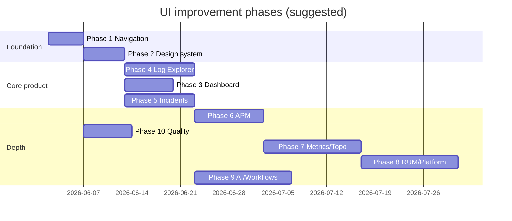

# UI Improvement Roadmap

**Purpose:** Trackable, phase-wise plan for NeuralOps frontend UX/UI work.  
**Audience:** Product, design, frontend engineering  
**Related:** [UI_DYNATRACE_GAP.md](./UI_DYNATRACE_GAP.md), [UI_DYNATRACE_IMPLEMENTATION_PLAN.md](./UI_DYNATRACE_IMPLEMENTATION_PLAN.md), [FRONTEND_STACK.md](./FRONTEND_STACK.md), [LOCAL_TEST_URLS.md](./LOCAL_TEST_URLS.md)

**Status legend**

| Symbol | Meaning |
|--------|---------|
| `[ ]` | Not started |
| `[~]` | In progress |
| `[x]` | Done |
| `[-]` | Deferred / out of scope |

**Last updated:** 2026-06-01 (phases P1–P11 implemented)

---

## Completed (baseline — do not re-implement)

| ID | Item | Notes |
|----|------|-------|
| UI-000 | Aurora / Lumen dual theme + theme toggle | `design-tokens.css`, `themeStore`, TopBar, Login |
| UI-001 | Sidebar independent scroll | `.sidebar__nav` overflow, shell height constraints |
| UI-002 | Demo banner layout fix | Banner in `app-main-column`, not beside sidebar |
| UI-003 | Docker quickstart fresh UI builds | `quickstart.sh` — `--no-cache`, `--force-recreate`, prune |
| UI-004 | Nginx no-store cache for static assets | `frontend/nginx.conf` |

---

## Phase 1 — Navigation & shell polish

**Goal:** Faster orientation, less sidebar fatigue, consistent global chrome.  
**Estimate:** 3–5 days  
**Priority:** P0

| ID | Status | Task | Acceptance criteria |
|----|--------|------|-------------------|
| P1-01 | `[x]` | Group sidebar into collapsible sections | Sections: Observe, Respond, Platform, Automate, Admin; collapsed state persists in `localStorage` |
| P1-02 | `[x]` | Wire top-bar search to Command Palette | Focus/click on top `SearchInput` opens ⌘K/Ctrl+K palette |
| P1-03 | `[x]` | Expand Command Palette coverage | All sidebar routes + actions (e.g. “New dashboard”, “Create SLO”) |
| P1-04 | `[x]` | Sidebar favorites / recents | Up to 5 pinned routes at top of nav |
| P1-05 | `[x]` | `aria-current="page"` + nav `aria-label` | Screen readers announce active route |
| P1-06 | `[x]` | Skip link (“Skip to main content”) | Visible on keyboard focus, jumps to `main` |
| P1-07 | `[x]` | System theme option | Theme: Light / Dark / System (`prefers-color-scheme`) |
| P1-08 | `[x]` | Mobile sidebar drawer | &lt;768px: overlay drawer; default collapsed; hamburger in TopBar |
| P1-09 | `[x]` | Mobile filter sheet | Env + time range in bottom sheet when top bar controls hidden |

**Dependencies:** None  
**Files (typical):** `Sidebar.tsx`, `TopBar.tsx`, `CommandPalette.tsx`, `global.css`, `themeStore.ts`

---

## Phase 2 — Design system consistency

**Goal:** One visual language; no raw unstyled inputs on settings/forms.  
**Estimate:** 4–6 days  
**Priority:** P0

| ID | Status | Task | Acceptance criteria |
|----|--------|------|-------------------|
| P2-01 | `[x]` | Shared `Input` component | Label, hint, error, disabled; uses tokens |
| P2-02 | `[x]` | Shared `Textarea` / `FormField` wrapper | Consistent spacing with `Select`, `Button` |
| P2-03 | `[x]` | Migrate Alerts forms | Rules, channels, escalation, silences use shared inputs |
| P2-04 | `[x]` | Migrate SLOs, Workflows, Notebooks forms | Same as P2-03 |
| P2-05 | `[x]` | Migrate Log Settings, API Keys, SSO settings | Same as P2-03 |
| P2-06 | `[x]` | Standard page error banner | `PageStates` error with retry on all data pages |
| P2-07 | `[x]` | Loading skeletons on all list pages | Traces, K8s, RUM, Synthetic, Security, etc. |
| P2-08 | `[x]` | Empty state component variants | Illustration + title + description + primary CTA per domain |
| P2-09 | `[x]` | Extend `/design-system` page | Documents Input, empty states, form patterns |
| P2-10 | `[x]` | Chart theme helpers | Shared Recharts axis/grid/tooltip styles for light/dark |

**Dependencies:** Phase 1 optional for nav only  
**Files (typical):** `components/ui/*`, `pages/Alerts.tsx`, `pages/SLOs.tsx`, `lib/chartTheme.ts`

---

## Phase 3 — Command Center & global filters

**Goal:** Dashboard reflects real data; global time/env filters feel trustworthy.  
**Estimate:** 5–7 days  
**Priority:** P1

| ID | Status | Task | Acceptance criteria |
|----|--------|------|-------------------|
| P3-01 | `[x]` | Real dashboard time-series | Charts use Prometheus/gateway API, not synthetic `sin()` data |
| P3-02 | `[x]` | Global filter sync | Env + time range in URL or store; child pages respect filters |
| P3-03 | `[x]` | Incident-first dashboard strip | P1/P2 count, latest incidents, link to focus mode |
| P3-04 | `[x]` | “War room” CTA | One click to newest open P1 incident detail (focus layout) |
| P3-05 | `[x]` | KPI drill-down | Click metric card → filtered logs/incidents |
| P3-06 | `[x]` | Dashboard auto-refresh indicator | “Updated 12s ago” + manual refresh |
| P3-07 | `[x]` | `prefers-reduced-motion` | Disable/limit framer-motion on dashboard when set |

**Dependencies:** Phase 2 (charts) recommended  
**Files (typical):** `Dashboard.tsx`, `filterStore.ts`, `api/dashboard.ts`

---

## Phase 4 — Log Explorer excellence

**Goal:** Best-in-class log UX for the product’s core strength.  
**Estimate:** 1–2 weeks  
**Priority:** P0

| ID | Status | Task | Acceptance criteria |
|----|--------|------|-------------------|
| P4-01 | `[x]` | Virtualized log table | Smooth scroll at 50k+ rows via `@tanstack/react-virtual` |
| P4-02 | `[x]` | Saved searches | Save/load named queries; stored per tenant/user |
| P4-03 | `[x]` | Shareable log URLs | Query params restore filters + search |
| P4-04 | `[x]` | Match highlighting | Regex/Grok matches highlighted in message column |
| P4-05 | `[x]` | Column resize + reorder | Persist preferences in `localStorage` |
| P4-06 | `[x]` | Live tail mode | Optional streaming with pause + clear |
| P4-07 | `[x]` | Export selection | CSV/JSON export for current result set |
| P4-08 | `[x]` | Log row → trace link | When `traceId` present, link to `/traces/$id` |
| P4-09 | `[x]` | Histogram / time brush | Click bucket to narrow time range |

**Dependencies:** Phase 2 (empty/loading states)  
**Files (typical):** `pages/Logs.tsx`, `components/logs/*`

---

## Phase 5 — Incidents & alerting UX

**Goal:** Faster incident response workflows for on-call engineers.  
**Estimate:** 1–2 weeks  
**Priority:** P1

| ID | Status | Task | Acceptance criteria |
|----|--------|------|-------------------|
| P5-01 | `[x]` | Incident list keyboard nav | `j`/`k` move, Enter open, `/` focus search |
| P5-02 | `[x]` | Sticky incident actions | Acknowledge, Resolve, Assign always visible on detail |
| P5-03 | `[x]` | Assignee + notes | UI for owner and resolution notes (API if missing) |
| P5-04 | `[x]` | Timeline polish | Icons per event type, relative + absolute time |
| P5-05 | `[x]` | Traces tab deep link | Open trace from evidence without manual ID paste |
| P5-06 | `[x]` | Alerts inbox improvements | Group by service, bulk acknowledge |
| P5-07 | `[x]` | Alert rule builder validation | Inline errors before submit |
| P5-08 | `[x]` | Silence preview | Show which alerts would be affected |

**Dependencies:** Phase 2 (forms)  
**Files (typical):** `pages/Incidents.tsx`, `components/incident/*`, `pages/Alerts.tsx`

---

## Phase 6 — APM & traces

**Goal:** Move trace views from demo/partial to production-credible.  
**Estimate:** 1–2 weeks  
**Priority:** P1

| ID | Status | Task | Acceptance criteria |
|----|--------|------|-------------------|
| P6-01 | `[x]` | Real trace list from API | No hard dependency on `trace-demo-*` IDs |
| P6-02 | `[x]` | Trace compare from picker | Select two traces in UI, not only query params |
| P6-03 | `[x]` | Waterfall interactions | Expand/collapse, copy span ID, duration sort |
| P6-04 | `[x]` | Flame graph zoom | Pan/zoom + keyboard focus |
| P6-05 | `[x]` | Span → logs | “View logs” prefilled with `traceId` |
| P6-06 | `[x]` | Service flow graph | Interactive nodes (click → entity or traces) |
| P6-07 | `[x]` | Latency heatmap | Service × time heatmap on trace explorer |

**Dependencies:** Backend trace coverage in ClickHouse  
**Files (typical):** `pages/TraceExplorer.tsx`, `TraceDetail.tsx`, `TraceCompare.tsx`, `ServiceFlow.tsx`

---

## Phase 7 — Dashboards, metrics & topology

**Goal:** Depth on observability builder surfaces (Dynatrace parity).  
**Estimate:** 2–3 weeks  
**Priority:** P2

| ID | Status | Task | Acceptance criteria |
|----|--------|------|-------------------|
| P7-01 | `[x]` | Dashboard tile drag-and-drop | Reorder + resize grid; persist layout |
| P7-02 | `[x]` | Dashboard variables | Service/env variables drive all tiles |
| P7-03 | `[x]` | PromQL editor | Autocomplete, history, error underline |
| P7-04 | `[x]` | Metrics explorer chart types | Line, bar, stat, table |
| P7-05 | `[x]` | Service map interactions | Zoom, pan, click node → entity page |
| P7-06 | `[x]` | Topology legend + filters | Health, namespace, dependency type filters |
| P7-07 | `[x]` | Unified entity shell | `/entities/:type/:id` tabs: Overview, Metrics, Logs, Traces |

**Dependencies:** Phases 2–3  
**See also:** [UI_DYNATRACE_GAP.md](./UI_DYNATRACE_GAP.md) §5

---

## Phase 8 — RUM, synthetic & platform views

**Goal:** Credible end-user and platform monitoring screens.  
**Estimate:** 2 weeks  
**Priority:** P2

| ID | Status | Task | Acceptance criteria |
|----|--------|------|-------------------|
| P8-01 | `[x]` | RUM session replay player | Play/pause, timeline, event list |
| P8-02 | `[x]` | RUM vitals dashboard | LCP, FID, CLS distributions |
| P8-03 | `[x]` | Synthetic monitor map | Geo/latency by location |
| P8-04 | `[x]` | K8s workload table | Sortable pods/deployments from collector data |
| P8-05 | `[x]` | Infra host detail drawer | CPU/mem/disk sparklines per host |
| P8-06 | `[x]` | Database slow query table | Sort by p95, link to traces |
| P8-07 | `[x]` | Kafka lag viz | Consumer group lag chart |

**Dependencies:** Collector + API data quality  
**Files (typical):** `pages/RUM.tsx`, `Synthetic.tsx`, `Kubernetes.tsx`, `Infrastructure.tsx`

---

## Phase 9 — AI Assistant & workflows

**Goal:** Differentiated AI UX with traceable citations.  
**Estimate:** 1–2 weeks  
**Priority:** P2

| ID | Status | Task | Acceptance criteria |
|----|--------|------|-------------------|
| P9-01 | `[x]` | Page-aware context | Chat knows current route (logs, incident id) |
| P9-02 | `[x]` | Citations | Links to log lines, traces, incidents in answers |
| P9-03 | `[x]` | Suggested prompts | Starters per page (“Summarize this incident”) |
| P9-04 | `[x]` | Workflow visual editor | Step list + drag reorder (not only JSON) |
| P9-05 | `[x]` | Notebook cell types | Markdown, log query, PromQL with run button |
| P9-06 | `[x]` | Notebook output embed | Charts inline after execution |

**Dependencies:** Gateway chat API enhancements  
**Files (typical):** `pages/AIChat.tsx`, `WorkflowEditor.tsx`, `Notebooks.tsx`

---

## Phase 10 — Accessibility & quality gates

**Goal:** Enterprise-ready a11y and regression safety.  
**Estimate:** 1 week (+ ongoing CI)  
**Priority:** P1

| ID | Status | Task | Acceptance criteria |
|----|--------|------|-------------------|
| P10-01 | `[x]` | Focus visible everywhere | Tokenized `:focus-visible` ring on interactive elements |
| P10-02 | `[x]` | Light mode contrast pass | WCAG AA on text, buttons, badges (Lumen theme) |
| P10-03 | `[x]` | axe in CI | Fail build on critical a11y violations (subset of pages) |
| P10-04 | `[x]` | Playwright smoke suite | Login → dashboard → logs → incident |
| P10-05 | `[-]` | Visual regression (optional) | Chromatic or Percy on design-system + dashboard — deferred |
| P10-06 | `[x]` | Keyboard trap audit | Modals, command palette, drawers |

**Dependencies:** Phases 1–2 stabilize shell  
**Files (typical):** `frontend/e2e/*`, `.github/workflows/ci.yml`

---

## Phase 11 — Engineering velocity (enablers)

**Goal:** Ship UI phases faster with less drift.  
**Estimate:** Ongoing  
**Priority:** P2

| ID | Status | Task | Acceptance criteria |
|----|--------|------|-------------------|
| P11-01 | `[x]` | Storybook (or expand design-system route) | All `ui/*` components with states |
| P11-02 | `[x]` | Tailwind `@theme` token bridge | Map CSS variables to Tailwind utilities |
| P11-03 | `[x]` | Feature flags for partial pages | `VITE_FEATURE_*` hide unfinished nav items |
| P11-04 | `[x]` | Route-level code splitting | Lazy load heavy pages (service map, RUM) |
| P11-05 | `[x]` | UI changelog in `CHANGELOG.md` | User-visible UI changes per release |

**Dependencies:** None

---

## Suggested implementation order

**Recommended sprint sequence:**  
`P1 → P2 → P4 → P3 → P5 → P10 (parallel) → P6 → P7 → P8 → P9 → P11`

---

## How to track progress

1. Update **Status** column in this file (`[ ]` → `[~]` → `[x]`).  
2. Link PRs in the table (add column `PR` when used).  
3. For Dynatrace parity depth, cross-reference [UI_DYNATRACE_GAP.md](./UI_DYNATRACE_GAP.md) matrix when closing P7–P8.  
4. Do not duplicate backend-only work here — UI must expose it to count as done.

---

## Out of scope (documented elsewhere)

| Item | Where tracked |
|------|----------------|
| Dynatrace agent / OneAgent parity | [UI_DYNATRACE_GAP.md](./UI_DYNATRACE_GAP.md), backend/deploy |
| Mobile native app | `mobile/` |
| Production GTM, pricing | [PRODUCTION_AND_GTM.md](./PRODUCTION_AND_GTM.md) |
| OpenAPI / contract tests | [API.md](../API.md), `backend/tests/contract` |

---

## Revision history

| Date | Version | Changes |
|------|---------|---------|
| 2026-06-01 | 1.1 | Phases P1–P11 implemented in frontend (P10-05 visual regression deferred) |
| 2026-06-01 | 1.0 | Initial roadmap from UI review (themes, sidebar, quick wins, depth phases) |
