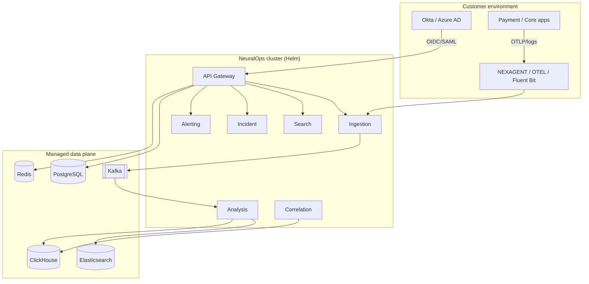

# NeuralOps Architecture Overview (BANK-001)

**Version:** 1.0  
**Audience:** Bank vendor risk, architecture review, security assessors

Export this document (or render diagrams) to PDF for RFP submissions.

---

## 1. Logical architecture



---

## 2. Data flows

| Flow | Data | Encryption | Retention |
|------|------|------------|-----------|
| Ingest | Logs, traces, metrics | TLS in transit; at-rest per datastore | Tenant policy |
| Auth | JWT, SSO tokens | TLS; keys in Vault/KMS | Session TTL |
| AI RCA | Prompt + incident context | Customer LLM endpoint; no training | Ephemeral |
| FinOps | CUR/billing line items | TLS; Postgres + optional S3 | Finance policy |
| Audit | Admin/API actions | Append-only Postgres (+ CH replica) | 1–7 years |

Detailed narrative: [DATA_FLOW.md](./DATA_FLOW.md), [SECURITY_PACK.md](./SECURITY_PACK.md).

---

## 3. Trust boundaries

1. **Customer VPC / K8s** — NeuralOps runs inside customer boundary for self-hosted SKU.
2. **Gateway** — Single north-south API; RBAC + ABAC + tenant isolation.
3. **Data plane** — Customer-managed Postgres/Kafka/ES/CH; no multi-tenant sharing in Enterprise SKU.
4. **Egress** — Optional air-gap; LLM calls only to customer-approved endpoints.

---

## 4. Deployment models

| Model | Helm | IdP | Data plane |
|-------|------|-----|------------|
| Enterprise self-hosted | Customer K8s | Customer IdP | Customer managed |
| Dedicated cloud | Vendor VPC | Customer IdP federation | Isolated per customer |
| Multi-tenant SaaS | Vendor K8s | Vendor + customer SSO | Shared (Gate E+) |

---

## 5. PDF export

```bash
# From repo root (requires npx @mermaid-js/mermaid-cli or pandoc)
pandoc docs/bank/ARCHITECTURE_OVERVIEW.md docs/bank/DATA_FLOW.md \
  -o neuralops-architecture-pack.pdf
```

---

## Related

- [BANK_PRODUCTION_READINESS_ROADMAP.md](../BANK_PRODUCTION_READINESS_ROADMAP.md)
- [MANAGED_DATA_PLANE.md](../runbooks/MANAGED_DATA_PLANE.md)
